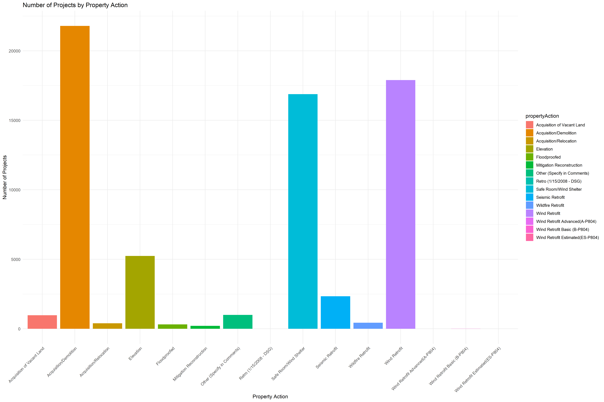

```{r, warning=FALSE, message=FALSE}
library(readr)
hma <- read_csv("HazardMitigationAssistanceProjects(cleaned).csv")
hma_prop <- read_csv("HazardMitigationAssistanceMitigatedProperties_cleaned.csv")
```

```{r, state_heatmap, warning=FALSE, message=FALSE}
library(ggplot2)
library(dplyr)
library(sqldf)
library(maps)
library(mapdata)

data_s = sqldf('SELECT LOWER(state) as state, count(*) as count FROM hma GROUP BY state')
state_map = map_data("state")
merged_data_s = sqldf('SELECT cm.*, d.count FROM data_s d INNER JOIN state_map cm ON d.State = cm.region')

shm = ggplot(merged, aes(x = long, y = lat, group = group, fill = count)) +
  geom_polygon() +
  scale_fill_gradient(low = "grey", high = "blue", 
                      name = "Number of Occurances") +
  labs(title = "State-Level Number of Occurances of Mitigation Programs") +
  theme_minimal()

ggsave("stateheatmap.png", plot = shm, width = 18, height = 12)
```


```{r, county_heatmap, warning=FALSE, message=FALSE}
library(maps)
data_c = sqldf('SELECT LOWER(state) as state, LOWER(county) as county, count(*) as count FROM hma GROUP BY state, county')
county_map = map_data("county")
merged_data_c = sqldf('SELECT cm.*, d.count FROM data_c d INNER JOIN county_map cm ON d.State = cm.region AND d.county = cm.subregion')

chm = ggplot(merged_data_c, aes(x = long, y = lat, group = group, fill = count)) +
  geom_polygon() +
  scale_fill_gradient(low = "grey", high = "blue") +
  labs(title = "County-Level Number of Occurances of Mitigation Programs") +
  theme_minimal()

ggsave("countyheatmap.png", plot = chm, width = 18, height = 12)
```


```{r, state_bargraph, warning=FALSE, message=FALSE}
data_s = sqldf('SELECT LOWER(state) as state, count(*) as count FROM hma GROUP BY state')
state_map = map_data("state")
merged_data_s = sqldf('SELECT cm.*, d.count FROM data_s d INNER JOIN state_map cm ON d.State = cm.region')

g = ggplot(merged_data_s, aes(x = region, y = count, fill = region)) +
  geom_bar(stat = "identity") +
  labs(x = "State", y = "Count", title = "Bar Plot by State") +
  theme_minimal() +
  theme(axis.text.x = element_text(angle = 45, hjust = 1),
        plot.title = element_text(size = 18),  # Title text size
    axis.title.x = element_text(size = 16),  # X-axis label text size
    axis.title.y = element_text(size = 14),  # Y-axis label text size
    axis.text = element_text(size = 16))  # Tick label text size) # Rotate x-axis labels for better readability

# Save the larger plot to a file
ggsave("state_barplot.png", plot = g, width = 22, height = 11)
```


```{r, propbarplot, warning=FALSE, message=FALSE}
data_pa = sqldf('SELECT propertyAction, count(*) as count FROM hma_prop GROUP BY propertyAction HAVING propertyAction is not null')

pa = ggplot(data_pa, aes(x = propertyAction, y = count, fill = propertyAction)) +
  geom_bar(stat = "identity") +
  labs(x = "Property Action", y = "Number of Projects", title = "Number of Projects by Property Action") +
  theme_minimal() +
  theme(axis.text.x = element_text(angle = 45, hjust = 1))

# Save the larger plot to a file
ggsave("prop_barplot.png", plot = pa, width = 18, height = 12)
```


```{r, prop_map, warning=FALSE, message=FALSE}
library(colorspace)

data_pa = sqldf('SELECT propertyAction, LOWER(state) as state, count(*) as count FROM hma_prop GROUP BY propertyAction HAVING propertyAction is not null')
state_map = map_data("state")
merged_data_pa = sqldf('SELECT cm.*, d.propertyAction, d.count FROM data_pa d INNER JOIN state_map cm ON d.state = cm.region')

ggplot(merged_data_pa, aes(x = long, y = lat, group = group, fill = count)) +
  geom_polygon() +
  scale_fill_gradient(low = "grey", high = "blue") +
  labs(title = "State-Level Heatmap") +
  theme_minimal()
```

```{r, prop_pie, warning=FALSE, message=FALSE}
library(scales)
data_pp = sqldf('SELECT propertyAction, count(*) as count FROM hma_prop GROUP BY propertyAction HAVING propertyAction is not null')

png("prop_piechart.png", width = 1100, height = 900)
par(mar = c(4, 3, 3, 3))
plot.new()
pie(data_pp$count,
    labels = sprintf("%s", percent(data_pp$count / sum(data_pp$count))),
    col = rainbow_hcl(14),
    main = "Spread of Property Action in the US",
    clockwise = TRUE, cex.main = 1.7, cex.lab = 0.2)

legend("bottomright", legend = data_pp$propertyAction, fill = rainbow_hcl(14), cex = 0.9)
```


